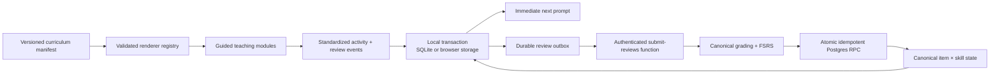

# Kanakana architecture

## Design goal

The learner sees a simple guided journey. Internally, curriculum content, teaching presentation, assessed skill, memory state, and synchronization are separate concerns.



## Domain model

`LearningItem` is generic and versioned. Hiragana content currently contains a glyph, Hepburn answer, accepted alternatives, and gojūon placement. A future kanji item can add meanings, multiple readings, components, and stroke resources without changing learner progress keys.

`SkillDefinition` describes one independently scheduled competency. V1 has `kana_reading`. Future examples include audio recognition, handwriting production, kanji meaning recall, or vocabulary reading.

`LearnerSkillState` is uniquely addressed by:

```text
user_id × item_id × skill_id
```

This is why a learner can be strong at recognizing `ら` visually but due for a different future `ら` skill.

## Flexible teaching modules

A curriculum release contains ordered units. Units group only first exposure; they do not couple later review schedules.

The client registry supports:

- `kana-introduction-v1`
- `kana-reading-input-v1`
- `session-summary-v1`

Remote content can reconfigure shipped renderers without a release. A genuinely new interaction—a tracing exercise, animation, or game—ships a new renderer, but still emits the same item-level attempts and writes the same progress tables. Invalid or unsupported remote modules never become active; the bundled validated manifest remains available.

Exposure and completion events document participation. Only assessed attempts alter memory state.

## Local-first lifecycle

Native uses `expo-sqlite` with WAL mode and an exclusive transaction for snapshot plus outbox writes. Web uses `localStorage` because Expo SQLite web support is alpha. Both satisfy `LearningRepository`.

At launch:

1. Render from durable local state.
2. Drop a stale active session if its local calendar day changed; otherwise resume it.
3. Authenticate anonymously and synchronize when configured.
4. Fetch and validate a newer published curriculum only outside an active session.
5. Pin the active session to one manifest version.

At every answer, the app:

1. Grades locally for immediate UX.
2. Applies optimistic FSRS.
3. Persists the review and new state atomically before advancing.
4. Flushes after every five events, at summary, on background, and next launch.

Network failure leaves the outbox intact and never blocks practice.

## Server trust boundary

The client cannot write `review_events` or `learner_skill_states` directly.

`submit-reviews`:

1. Requires and verifies the user JWT.
2. Validates the batch shape and size.
3. Reloads the latest published item and skill definitions.
4. Re-grades the raw pending answer.
5. Maps incorrect/revealed to `Again`, correct to `Good`.
6. Recomputes FSRS from canonical state.
7. Calls `commit_review_event` with the current expected state version.
8. Retries one optimistic-concurrency conflict against refreshed state.
9. Returns exact accepted event IDs and canonical states.

The RPC performs state transition and event insert in one database transaction. Event UUIDs make retries idempotent. The database stores correctness, classification, timing, version, and rating—never arbitrary typed answer text.

RLS allows published curriculum reads and restricts every learner row to `auth.uid()`. Review history and mastery have SELECT-only client grants; mutation occurs through the authenticated security-definer RPC.

## Scalability

- API and Edge Function instances hold no session state and can scale horizontally.
- Each event is independently idempotent.
- Due-state lookup uses an index on `(user_id, due)`.
- Curriculum releases are immutable and cacheable.
- Review writes are narrow rows keyed by user/item/skill.
- Clients do not require sticky sessions and continue offline during backend pressure.

## Future kanji

The review event, outbox, SRS state, sync, and teaching-module contracts remain unchanged. Kanji requires:

- new `LearningItem.kind = "kanji"` content fields;
- new skills such as meaning recall and reading recall;
- renderer modules appropriate to those skills;
- later relationship tables for vocabulary, components, and contextual examples.

It does not require replacing the current progress architecture.
